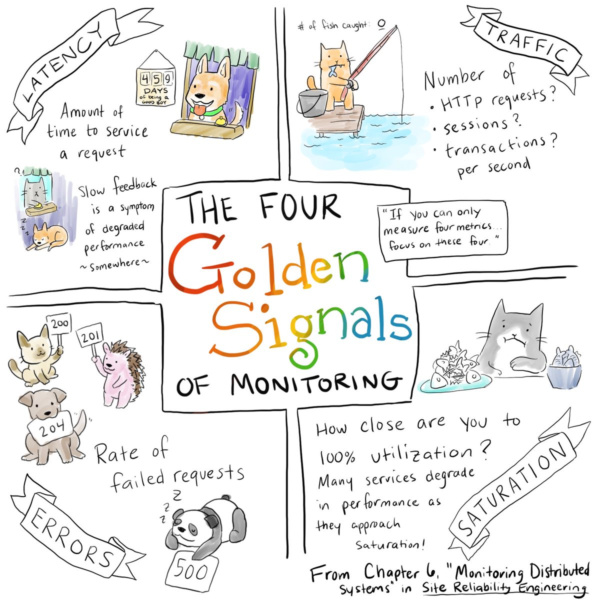

# SRE Terminology

The service level terminology forms the foundational tools that a SRE team needs to be effective. First we will define the 3 key service level terms: Indicators, Objectives, and Agreements. Then we'll talk about how SLO's tie into Error Budgets, then we'll briefly discuss how to approach alerting.

 

## Service Level Indicator (SLI)

SLI is a carefully defined quantitative measure of some aspect of the level of service being provided. These measures can be gathered either server-side or client-side, but most of the time monitoring and log analysis systems are in place providing the collection. Every system is different, but it is common to use the "Four Golden Signals" as a starting point.

 

### The Four Golden Signals
* Request Latency - How long does it take to service a request? 
* Traffic - How much demand is being placed on the system?
* Error Rate - What is the rate of failed requests?
* Saturation - How overloaded is the system?

 

 

The four golden signals are a great place to start for most common systems, there are other SLI's that can be used, depending on the needs and type of the system being monitored. For example, a data storage system might use data durability as a SLI. System availability is another important SLI.

 

## Service Level Objective (SLO)

SLO is the a target range of values for a service level that is measured by an SLI. These values should represent the acceptable behavior that a user or consumer of the service should be experiencing. The SLO can and should be adjusted, at will, by the combined product/SRE/development team based on the needs of the organization and expectations of users.

This is the term that SRE's tend to focus on because it helps to construct a view into the overall health of the system. During this workshop you will be focusing on creating, monitoring, and reacting to system performance, as it relates to the constructed SLO's. 

 

## Service Level Agreement (SLA)

SLA is probably the most well known of the terms discussed so far. It is the explicit or implicit contract with your users, which includes the consequences of meeting or breaching the SLA. Depending on the service, it is common to see financial consequences associated with breach of an SLA. SLA's typically require lawyers to change since they are associated with contracts. There can be one or more SLO's associated with an SLA; the SLO should **ALWAYS** be set to a tighter tolerance than the SLA.

 

## Building Good SLO's

When defining an SLO it's important to think about what the core characteristics of the system are and how the user interfaces with them. They should also be specific on how they are measured and what is an acceptable condition. It is important to remember that it takes practice and continuous refinement to build good SLO's so the team should be willing to modify them, as needed.

Here are a couple suggestions on how to choose your SLO's more effectively:

* Don't pick a target based on current performance - Current performance may not be reasonable as you scale and may set unrealistic expectations as to what is possible to support.
* Keep it simple - Complicated aggregations of SLI's can obscure changes in system performance.
* Avoid absolutes - It's not possible to scale "infinitely" or "always" be available.
* Have as few SLO's as possible - Choose just enough SLO's to provide coverage of your system's attributes.
* Perfection can wait - It is better to start with a loose target and tighten it up as you learn about the system's behavior.
* Set your SLO at the "Hadness Point" - This is the point where your user's happiness about the service is on the verge of changing from positive to negative.

 

## Error Budgets

In the last lab it was mentioned that SRE's accept risk and manage it. 100% reliability isn't feasible nor reasonable to expect in any system. The SLO inherently describes an acceptable level of unreliability, and risk, within the system during a given time frame. The Error Budget is used to determine how much of that allowable unreliability has been present in the system and how much of that budgeted unreliability is left. You can calculate your error budget by subtracting 1 - "SLO of the service". An example of this would be:

>A 99.9% SLO has a 0.1% error budget. 

If our service receives 1,000,000 requests in four weeks, a 99.9% availability of the SLO provides a budget of 1,000 errors over that period.

 

### What Happens if We Do Not Exceed Our Error Budget?

The Error budget is the acceptable amount of risk that's been introduced into the system, which means if the Error Budget is not exceeded in the time frame, the remaining budget can be used for work that might introduce risk. Some of the items you might spend your surplus Error Budget on are:

* Feature releases
* Making configuration or architectural changes to the system
* Planned downtime
* Experiments
* Leave room in the budget for potential failures in hardware, network, etc

 

### What Happens if We Exceed Our Error Budget?

If the Error Budget is exceeded during the time frame then any changes that will add risk to the system must be postponed. This means that feature releases must be frozen and the engineering teams will have to prioritize the technical debt or post mortem items to reduce the number of bad events impacting the SLO. Additionally, it may mean that additional monitoring and observability needs to be introduced to the system or alerting should be adjusted to allow for a more proactive response.

 

## Summary

In this lab we discussed the key terminology that SRE's use to describe how their systems are performing and how to manage the risk associated with the system. Now it's time to put this knowledge to the test and build our first SLO.
