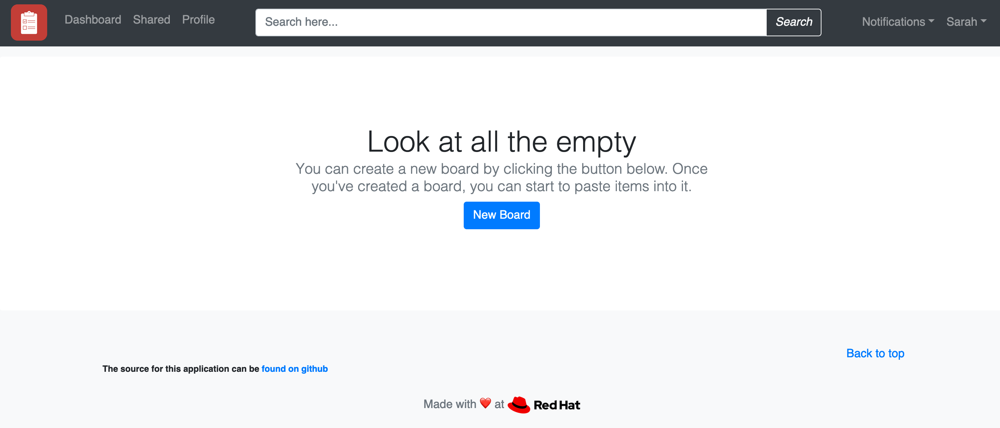

# Setup

In order to demonstrate SRE principles on OpenShift, we need a microservices application that we can play with.  Additionally, we need service-to-service communication metrics (e.g. the four golden signals) to build SLOs.  This lab has pre-built a microservices application based on [this repo][1].  We will also use [OpenShift Service Mesh][2] to gather metrics to build our SLOs.  If you aren't familiar with service mesh, think of it as an additional infrastructure layer for our microservices.  While a service mesh adds value in many different ways, we will focus solely on the metrics for SLOs.

## Get Started

Let's do a check to make sure your environment is configured correctly.  First, test you have access to the OpenShift cluster via the `oc` CLI.

<blockquote>
<i class="fa fa-terminal"></i> You should already be logged in to your cluster in your web terminal.
</blockquote>

Switch to the **Terminal** tab, and try running:

```execute
oc whoami
```
*You can click the play button in the top right corner of the code block to automatically execute the command for you.*

<br>

Next, download a local copy of the workshop repo:

```execute
git clone https://github.com/RedHatGov/sre-workshop-code.git
```

The instructor will have preconfigured your projects for you.  Let's double check:

<blockquote>
<i class="fa fa-terminal"></i> List your projects:
</blockquote>

```execute
oc projects
```

You should see two projects: your user project (e.g. '%username%') and '%username%'-istio.  

<br>

The '%username%-istio` project is a service mesh dedicated to your project.

<blockquote>
<i class="fa fa-terminal"></i> List the pods in the service mesh project:
</blockquote>

```execute
oc get pods -n '%username%'-istio
```

Output:

```
NAME                                      READY   STATUS    RESTARTS   AGE
grafana-xxxxxxxxx-xxxxx                   2/2     Running   0          17m
istio-citadel-xxxxxxxxx-xxxxx             1/1     Running   0          20m
istio-egressgateway-xxxxxxxx-xxxxx        1/1     Running   0          17m
istio-galley-xxxxxxxx-xxxxx               1/1     Running   0          19m
istio-ingressgateway-xxxxxxxxx-xxxxx      1/1     Running   0          17m
istio-pilot-xxxxxxxxx-xxxxx               2/2     Running   0          18m
istio-policy-xxxxxxxxx-xxxxx              2/2     Running   0          19m
istio-sidecar-injector-xxxxxxxxx-xxxxx    1/1     Running   0          17m
istio-telemetry-xxxxxxxxx-xxxxx           2/2     Running   0          19m
prometheus-xxxxxxxxx-xxxxx                2/2     Running   0          19m
```

<br>

<blockquote>
<i class="fa fa-terminal"></i> Switch to your user project.  For example:
</blockquote>

```execute
oc project '%username%'
```

<br>

A microservices application has been deployed for you in this project.  Let's take a look.

<blockquote>
<i class="fa fa-terminal"></i> List the pods in the project:
</blockquote>

```execute
oc get pods
```

Output (sample):

```
NAME                      READY   STATUS      RESTARTS   AGE
app-ui-1-deploy           0/1     Completed   0          22h
app-ui-1-xxxxx            2/2     Running     0          22h
boards-1-xxxxx            2/2     Running     0          22h
boards-1-deploy           0/1     Completed   0          22h
boards-mongodb-1-deploy   0/1     Completed   0          22h
boards-mongodb-1-xxxxx    2/2     Running     0          22h
```

<br>

## Explore the Application

It's time to explore your application!  We have to understand what the application does before we can create SLOs.  Let's access the application in the same way that your end users would access the app.

<blockquote>
<i class="fa fa-terminal"></i> Get the route to your microservices app:
</blockquote>

```execute
GATEWAY_URL=$(oc get route istio-ingressgateway -n %username%-istio --template='http://{{.spec.host}}')
echo $GATEWAY_URL
```

<blockquote>
<i class="fa fa-desktop"></i> Navigate to this URL in a new browser tab.  For example:
</blockquote>

```
http://istio-ingressgateway-userx-istio.apps.cluster-naa-xxxx.naa-xxxx.example.opentlc.com:6443
```

<br>

You should see:

<br/>

<br>

The example application's core functionality is a paste board.  Users can create boards and post comments to a shared board among all users.

<blockquote>
<i class="fa fa-terminal"></i> List the pods again:
</blockquote>

```execute
oc get pods
```

Output (sample):

```
NAME                      READY   STATUS      RESTARTS   AGE
app-ui-1-deploy           0/1     Completed   0          22h
app-ui-1-xxxxx            2/2     Running     0          22h
boards-1-xxxxx            2/2     Running     0          22h
boards-1-deploy           0/1     Completed   0          22h
boards-mongodb-1-deploy   0/1     Completed   0          22h
boards-mongodb-1-xxxxx    2/2     Running     0          22h
```

One microservice is the application UI.  The other is the boards API that talks to MongoDB.  A simple flow is interacting with the UI, which sends an API call to the boards microservice, which then stores or retrieves data from MongoDB.

There are a lot of ways this core app can be extended with additional functionality, but we'll stick with this core functionality.

<br>

Let's try creating a board, for example:

<br/>

<br>

Now try to post a comment to a shared board, for example:

<br/>

<br>

## Summary

The most important part of this lab was accessing and exploring your microservices app.  Why, you ask?  Because SLOs should focus on end user happiness.  If you don't understand the end user journey in your application, then it will be more difficult to create good SLOs that help you improve user experience.  You can learn more about this critical concept in [_The Site Reliability Workbook_][3].

[1]: https://github.com/dudash/openshift-microservices
[2]: https://www.openshift.com/learn/topics/service-mesh
[3]: https://landing.google.com/sre/workbook/chapters/implementing-slos/
