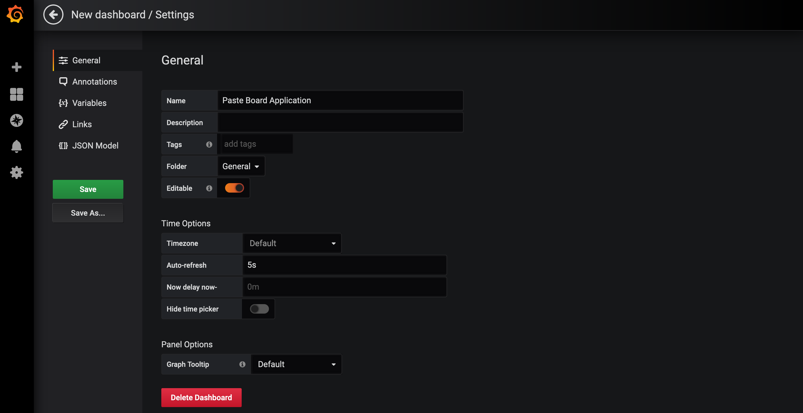

# Monitoring with Grafana

The next steps are to create SLOs for the application, proactively monitor SLOs, and put alerts in place when SLOs are breached.  These are fundamental SRE tasks that we need to get right.  Fortunately, OpenShift provides us technologies and tools to make this easier.  The service mesh layer is already configured to collect relevant metrics in our application.  Service mesh also deploys [Grafana][1], a visualization tool that we can use to build dashboards for our application.

Let's dig in and try this on OpenShift.  Before you proceed, let's start sending traffic to your application.

<blockquote>
<i class="fa fa-terminal"></i>
Send load to the application user interface:
</blockquote>

```execute
while true; do curl -s -o /dev/null $GATEWAY_URL; done
```

<br>

## Service Level Objectives

TODO

Service Level Objectives: 

* SLO #1: 95% of requests are successful and respond within 1 second
* SLO #2: 90% of requests are successful and respond within 500 milliseconds

## Setup Dashboard

Now that you have defined your SLOs, you need a way to monitor and visualize these in a dashboard.  Let's use Grafana for this task.

<blockquote>
<i class="fa fa-terminal"></i>
Open the Grafana console.  Retrieve the endpoint for Grafana:
</blockquote>

```execute
GRAFANA_CONSOLE=$(oc get route grafana -n %username%-istio --template='https://{{.spec.host}}')
echo $GRAFANA_CONSOLE
```
<p><i class="fa fa-info-circle"></i> Click 'Allow selected permissions' if prompted to authorized access.</p>

<blockquote>
<i class="fa fa-desktop"></i>
Navigate to this URL in a new browser tab.  Login with the same credentials you were provided to access OpenShift. 
</blockquote>

Once logged in, you should be presented with the Grafana console:

<br/>

<br>

TODO: If you prefer to follow along, import the preexisting dashboard.

<br>

In the left navigation bar, hover over the plus sign and select 'Create Dashboard'.

<br/>

<br>

On the top right, you should see a gear icon.  Hover over that for 'Dashboard settings'.  

<br/>

<br>

Give the Dashboard a new name.  Click 'Save' when done.

<br/>

<br>

Next, on the top right, change the time range from 'Last 6 hours' to 'Last 5 minutes'.

<br/>

<br>

Let's take a step back and review what you just did.  You created a Dashboard.  It doesn't have any graphs yet (Grafana calls these [Panels][2]), but you'll add these soon.  You also narrowed your time range.  What does this mean, and why?

Time range (also known as time window) means the range of time over which data is visualized for you.  'Last 5 minutes' shows you the data from the previous 5 minutes.  'Last 24 hours' would show you data from the last 24 hours.

Here's the important point.  In our SLOs, we didn't discuss the time range over which we would measure the SLO.  For example, in SLO #1, we want to ensure at least 95% of requests succeed and respond within 1 second.  But over what time window?  All the requests in the last 10 minutes?  All the requests in the last 24 hours?  A month?  Longer?  There is no one right answer.  The [_The Site Reliability Workbook_][3] describes considerations for choosing an appropriate time window for your SLO.  

In this workshop, you will use a rolling 1 minute window.  Keep in mind this is only for workshop purposes.  This window is too narrow and unrealistic for most real world situations.

With that in mind, here are the SLOs again (under workshop time constraints):

* SLO #1: 95% of requests are successful and respond within 1 second (measured in 1 minute interval)
* SLO #2: 90% of requests are successful and respond within 500 milliseconds (measured in 1 minute interval)

Finally, let's tie this back to what you did with the dashboard.  Since our time range will be 1 minute intervals, we have constrained the dashboard view to 'Last 5 minutes'.

## Setup SLO #1

It's time to add a graph to monitor our SLOs.  

On the top, hover over the 'Add panel' icon as shown below.

<br/>

<br>

Select 'Add Query'.  You should see the panel view.

<br/>

<br>

In order to visualize data, you have to tell Grafana what metrics to monitor for your SLO.  In our architecture, the service mesh layer exposes endpoints for metrics collection.  [Prometheus][4] is an open source tool that collects and stores these metrics.  Grafana is already integrated with Prometheus as a data source.  And in order to query Prometheus metrics data in Grafana, you use the [Prometheus Query Language][5], or 'PromQL'.

This is a fairly dense topic.  Feel free to read up on Prometheus later.  For now, what you need to know is that you need to enter a 'PromQL' query to pull metrics that monitor your SLO.  Let's spend some time building this query (don't worry, we'll do this together)!

You need to calculate the total number of requests sent to the user interface.  The below query says 'Give me the total number of requests that are sent to the user interface'.  

```
istio_requests_total{destination_service_name="app-ui"}
```

You need to calculate this over the 1 minute time interval (remember, we need a time window over which we measure our SLO).  The below query says 'Give me the total number of requests sent to the user interface over the last 1 minute' by using the Prometheus [increase][6] function.

```
increase(istio_requests_total{destination_service_name="app-ui"}[1m])
```

This previous query returns total requests broken down by response code.  Now all we have to do is sum it up.

```
sum(increase(istio_requests_total{destination_service_name="app-ui"}[1m]))
```

Enter this query into Grafana, and you should see something like the following:

<br/>

<br>

In summary, this graph shows you the total number of requests to the UI as measured over a 1 minute interval.

<br>

We need to take this query and determine availability of the user interface.  You'll do this using response codes.  Anything that is *not* a 500 response code is a succees.  The below query says 'Give me the total number of requests to the user interface that have succeeded, as measured over a 1 min interval'.

```
sum(increase(istio_requests_total{destination_service_name="app-ui", response_code!~"5.x"}[1m]))
```

One more thing.  We also want to add latency.  In SLO #1, we want all of the successful requests that returned within 1 second.  We use a different metric that buckets requests in terms of how quickly it responded to the end user.  The below query says 'Give me the total number of requests to the user interface that have succeeded and returned within 1 second, as measured over a 1 min interval.'

```
sum(increase(istio_request_duration_seconds_bucket{destination_service_name="app-ui", response_code!~"5.*", le="1"}[1m]))
```

Enter this query into Grafana, and you should see something like the following:

<br/>

<br>

Perfect.  Now you just need to take this query and divide it by the total requests to get your SLO measurement.  Here is the final query.

```
sum(increase(istio_request_duration_seconds_bucket{destination_service_name="app-ui", response_code!~"5.*", le="1"}[1m])) / sum(increase(istio_requests_total{destination_service_name="app-ui"}[1m]))
```

Enter this query into Grafana, and you should see something like the following:

<br/>

<br>

Let's pretty this up a bit:

* In 'Legend', put something more human readable.  For example, '% of successful requests to the UI that returned within 1 second (1 min interval)
* Under 'Visualization' Axes, change the unit to 'Misc - percent (0.0-1.0)'.  
* Under 'Visualization' Axes, change the Y-Min to '0' and Y-Max to '1.0'.
* Under 'Visualization' Thresholds & Time regions, add a threshold of less than ('lt') 0.95
* Under 'General' Title, change the title to 'SLO #1'
* Under 'General' Description, change the description to '95% of requests are successful and respond within 1 second (measured in 1 minute interval)'

Here are some images if you need help finding these settings:

<br/>

<br>

<br/>

<br>

Your first SLO is ready to go!  This shows you the percentage of successful requests as measured by SLO #1.  The red line indicates the threshold in which the SLO is breached.  Everything should look healthy right now.

<br/>

<br>

## Setup SLO #2


## Error Budgets


## Summary


[1]: https://grafana.com/
[2]: https://grafana.com/docs/grafana/latest/panels/panels-overview/
[3]: https://landing.google.com/sre/workbook/chapters/implementing-slos/#choosing-an-appropriate-time-window
[4]: https://grafana.com/blog/2020/02/04/introduction-to-promql-the-prometheus-query-language/
[5]: https://prometheus.io/docs/prometheus/latest/querying/basics/
[6]: https://prometheus.io/docs/prometheus/latest/querying/functions/#increase