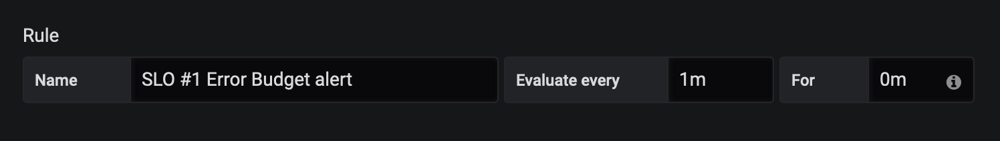

# Alerting with Grafana

The next step is to put alerts into place when SLOs are breached.  The image that comes to mind is the SRE being paged about an issue while on-call.  This is another fundamental task for a SRE.

Your initial thought might be: "Let's alert whenever the SLO graph dips below its threshold!"  While the approach is simple to implement, it has its shortcomings.  You could end up firing alerts multiple times but not actually breach the SLO.  (The workshop SLO uses an unrealistic 1 minute window so that's hard to imagine.  Instead, think about a 30 day window in which error rates spike periodically, but overall the SLO is not breached).

In fact, alerting is more complex.  Your instructor should have reviewed these concepts with you.  Here are some considerations taken from [_The Site Reliability Workbook_][1]:

* Precision: The proportion of alert events that are significant
* Recall: The proportion of significant events that are alerted on
* Detection Time: How long it takes to fire alert on event
* Reset Time: How long alerts fire for after issue is resolved

Alerting in a way that handles all four of these considerations is difficult.  [_The Site Reliability Workbook_][1] is a fantastic resource on this topic, and we won't rehash the contents of that here.  The general recommendation is to use the "Burn rate", which is how fast the error budget is exhausted relative to the SLO.  For this task, we will use an overly simplified burn rate calculation to alert on your SLOs.

## Burn Rate

Before you get started, remember that your SLOs use unrealistic time windows (1 min interval) because we are working with workshop time constraints.

In order to calculate the burn rate you want to alert on, you need to decide:

1.  How much error budget are you okay with exhausting before you are alerted?
2.  What alert window do you want to use?  (i.e. What time interval over which you measure the error rate?)

For this exercise, let's keep it simple:  

1. You want to be alerted after 50% of the error budget is consumed.
2. Your alert window is 1 minute.

'50% of the SLO error budget consumed over 1 minute' requires a burn rate of 0.5.  You can review the math for how to calculate this in [_The Site Reliability Workbook_][1].

## Setup SLO #1

Let's add the alert for the first SLO.  As a reminder, here is the first SLO:

* SLO #1: 95% of requests are successful and respond within 1 second

Using the burn rate, calculate the threshold as: 'Alert if the error rate over the past 1 minute is > burn rate x error budget'.  So the threshold is 0.5 (burn rate) x 0.05 (SLO #1 error budget) = 0.025.

Let's add this alert to your SLO #1 Error Budget graph.

Highlight the error budget graph and select 'Edit'.  Select 'Alert' on the bottom left icon and then select 'Create Alert'.

<br/>

<br>

The first thing you should notice is that the previously created threshold (5% error budget) is gone.  Your threshold is going to change because you are adding an alert.

Under 'Rule', put '0m' in the 'For' entry so it looks like this:

<br/>

<br>

Under 'Conditions', change to 'WHEN max() OF query(A,1m,now) IS ABOVE '0.025'.  It should look like this:

<br/>

<br>

<details>
  <summary>Why do we use max()?</summary>

  This is slightly tricky.  Your SLO query already measures error rate over a 1 minute threshold.  So we just want *any* data point in the last minute that breaches the threshold.

</details>

Go back to your dashboard page.  You should see a heart icon indicating an alert has been added to 'SLO #1 Error Budget'.  


<br/>

<br>

## Setup SLO #2

Let's add the alert for the second SLO. Set this up on your own by applying what you just learned.  As a reminder, here is the second SLO:

* SLO #2: 90% of requests are successful and respond within 500 milliseconds (measured in 1 minute interval)

Note: Use the same burn rate as the first SLO to calculate the threshold.  Don't just copy and paste the same threshold as the first SLO!

<details>
  <summary>Click here if you need help!</summary>

  Using the burn rate, calculate the threshold as: 'Alert if the error rate over the past 1 minute is > burn rate x error budget'.  So the threshold is 0.5 (burn rate) x (SLO #2 error budget).

</details>

After adding the second SLO error budget graph, your dashboard should look like this:

<br/>

<br>

## Test

Here's the fun part!  Let's do a quick test to see if alerting is actually working.

"Break the app" by scaling the user interface service down.

<blockquote>
<i class="fa fa-terminal"></i> Scale app down:
</blockquote>

```execute
oc scale --replicas=0 dc app-ui
```

Open your dashboard.  Wait a minute and hit the refresh icon in the top right:

<br/>

<br>

Your SLOs will be breached, and the error budget graphs will be highlighted in red.  It should look like this:

<br/>

<br>

Note: It will take at least a minute before the alert fires and the graphs turn red.  This is because the alert check occurs every minute.

In the left navigation bar, select 'Alert - Alert Rules':

<br/>

<br>

You should see two alerts corresponding to the alerts you created:

<br/>

<br>

It's working!  Let's put the app back into a healthy state.

<blockquote>
<i class="fa fa-terminal"></i> Scale app up:
</blockquote>

```execute
oc scale --replicas=1 dc app-ui
```

Wait a minute and the graphs should return to a healthy state.

<br/>

<br>

Note: It will take at least a minute before the red highlighting stops.  This is because the alert check occurs every minute.

## Summary

Configuring SLO and error budget alerts is not as easy as it may seem.  This lab gave you a good starting point for how to think about burn rates and configuring alerts in Grafana.

There are a couple of important things we didn't show.  In a real scenario, you need to integrate the alert with some type of notification system (e.g. email, ticketing system, Slack).  Also, you need to prioritize events so you can send high priority alerts differently than low priority alerts to on-call SREs.  

Alerting is a critical and complex topic.  We encourage you to learn more as you undertake the SRE journey.

[1]: https://landing.google.com/sre/workbook/chapters/alerting-on-slos/