# Monitoring with Grafana

The next steps are to create SLOs for the application and proactively monitor SLOs.  These are fundamental SRE tasks that we need to get right.  Fortunately, OpenShift provides us technologies and tools to make this easier.  The service mesh layer is already configured to collect relevant metrics in our application.  Service mesh also deploys [Grafana][1], a visualization tool that we can use to build dashboards for our application.

Let's dig in and try this on OpenShift.  Before you proceed, let's start sending traffic to your application.

<blockquote>
<i class="fa fa-terminal"></i>
Send load to the application user interface:
</blockquote>

```execute
while true; do curl -s -o /dev/null $GATEWAY_URL; done
```

<br>

## Service Level Objectives

It's time to create your SLOs!  In the introduction labs, we discussed the concept of the SLO and why it matters.  Your instructor should have also reviewed the considerations for creating good SLOs with you.

It's worth emphasizing that constructing good SLOs is not an easy task.  On your first attempt, the SLO may be too aggressive or too lax.  But that's ok!  Your first SLOs will probably not be perfect.  You should be iterating on SLOs over time as you learn more about the behavior of your application.

For this exercise, let's keep it simple and use the following SLOs:

* SLO #1: 95% of requests are successful and respond within 1 second
* SLO #2: 90% of requests are successful and respond within 500 milliseconds

### Setup Dashboard

Now that you have defined your SLOs, you need a way to monitor and visualize these in a dashboard.  Let's use Grafana for this task.

<blockquote>
<i class="fa fa-terminal"></i>
Open the Grafana console.  Retrieve the endpoint for Grafana:
</blockquote>

```execute
echo $(oc get route grafana -n %username%-istio --template='https://{{.spec.host}}')
```
<p><i class="fa fa-info-circle"></i> Click 'Allow selected permissions' if prompted to authorized access.</p>

<blockquote>
<i class="fa fa-desktop"></i>
Navigate to this URL in a new browser tab.  Login with the same credentials you were provided to access OpenShift. 
</blockquote>

Once logged in, you should be presented with the Grafana console:

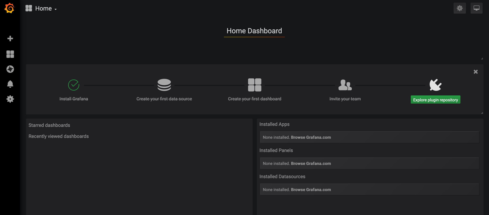<br/>

<br>

In the left navigation bar, hover over the plus sign and select 'Create Dashboard'.

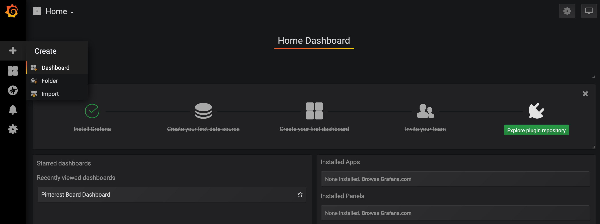<br/>

<br>

On the top right, you should see a gear icon.  Hover over that for 'Dashboard settings'.  

<br/>

<br>

Give the Dashboard a new name.  Set `Auto-refresh` to `5s`.  Keep the other settings as their default values.  Click 'Save' when done.

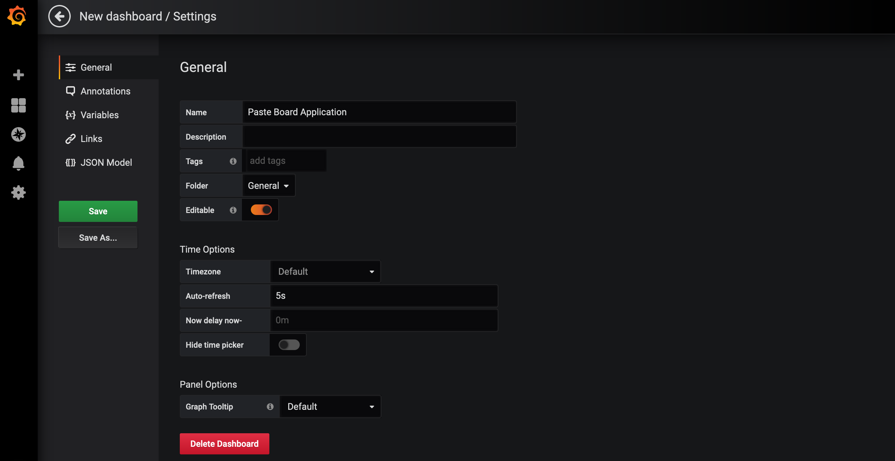<br/>

<br>

Next, on the top right, change the time range from 'Last 6 hours' to 'Last 5 minutes'.

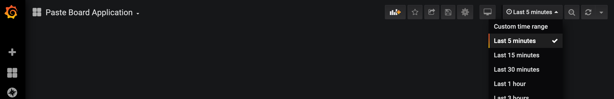<br/>

<br>

Let's take a step back and review what you just did.  You created a Dashboard.  It doesn't have any graphs yet (Grafana calls these [Panels][2]), but you'll add these soon.  You also narrowed your time range.  What does this mean, and why?

Time range (also known as time window) means the range of time over which data is visualized for you.  'Last 5 minutes' shows you the data from the previous 5 minutes.  'Last 24 hours' would show you data from the last 24 hours.

Here's the important point.  In our SLOs, we didn't discuss the time range over which we would measure the SLO.  For example, in SLO #1, we want to ensure at least 95% of requests succeed and respond within 1 second.  But over what time window?  All the requests in the last 10 minutes?  All the requests in the last 24 hours?  A month?  Longer?  There is no one right answer.  The [_The Site Reliability Workbook_][3] describes considerations for choosing an appropriate time window for your SLO.  

In this workshop, you will use a rolling 1 minute window.  Keep in mind this is only for workshop purposes.  This window is too narrow and unrealistic for most real world situations.

With that in mind, here are the SLOs again (under workshop time constraints):

* SLO #1: 95% of requests are successful and respond within 1 second (measured in 1 minute interval)
* SLO #2: 90% of requests are successful and respond within 500 milliseconds (measured in 1 minute interval)

Finally, let's tie this back to what you did with the dashboard.  Since our time range will be 1 minute intervals, we have constrained the dashboard view to 'Last 5 minutes'.

### Setup SLO #1

It's time to add a graph to monitor our SLOs.  Let's start with the first SLO.

On the top, hover over the 'Add panel' icon as shown below.

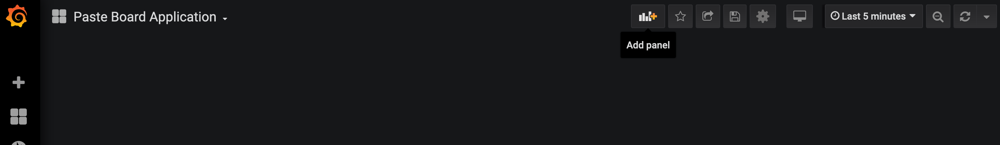<br/>

<br>

Select 'Add Query'.  You should see the panel view.

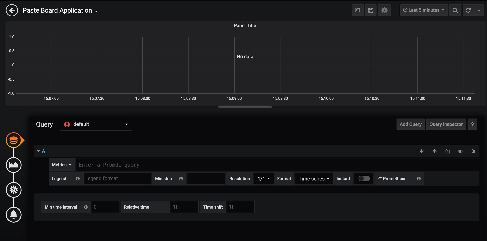<br/>

<br>

In order to visualize data, you have to tell Grafana what metrics to monitor for your SLO.  In our architecture, the service mesh layer exposes endpoints for metrics collection.  [Prometheus][4] is an open source tool that collects and stores these metrics.  Grafana is already integrated with Prometheus as a data source.  And in order to query Prometheus metrics data in Grafana, you use the [Prometheus Query Language][5], or 'PromQL'.

This is a fairly dense topic.  Feel free to read up on Prometheus later.  For now, what you need to know is that you need to enter a 'PromQL' query to pull metrics that monitor your SLO.  Let's spend some time building this query (don't worry, we'll do this together)!

You need to calculate the total number of requests sent to the user interface.  The below query says 'Give me the total number of requests that are sent to the user interface'.  

```
istio_requests_total{destination_service_name="app-ui"}
```

You need to calculate this over the 1 minute time interval (remember, we need a time window over which we measure our SLO).  The below query says 'Give me the total number of requests sent to the user interface over the last 1 minute' by using the Prometheus [increase][6] function.  It will return total request count broken down by response code.

```
increase(istio_requests_total{destination_service_name="app-ui"}[1m])
```

Now all we have to do is sum it up.

```
sum(increase(istio_requests_total{destination_service_name="app-ui"}[1m]))
```

Enter this query into Grafana, and you should see something like the following:

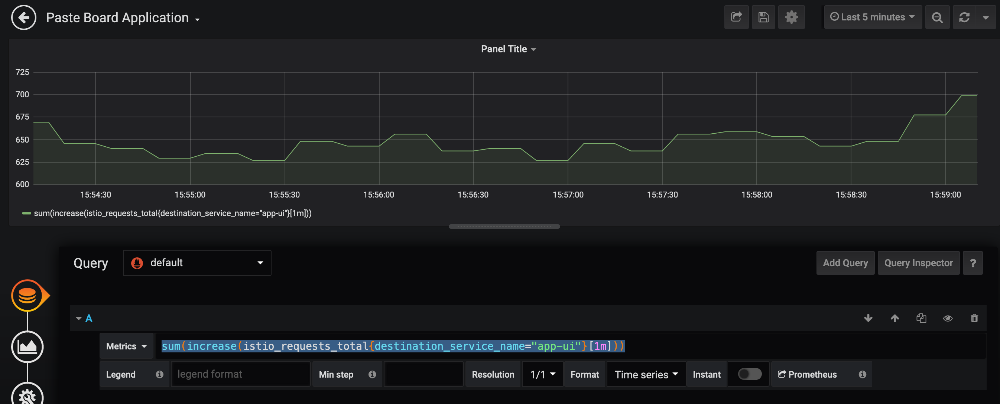<br/>

<br>

In summary, this graph shows you the total number of requests to the app UI as measured over a 1 minute interval.

<br>

You need to take this query and determine availability of the user interface.  You will do this using response codes.  Anything that is *not* a 500 response code is considered a succees.  The below query says 'Give me the total number of requests to the user interface that have succeeded, as measured over a 1 min interval'.

```
sum(increase(istio_requests_total{destination_service_name="app-ui", response_code!~"5.x"}[1m]))
```

One more thing.  You also need to add latency.  In SLO #1, we want all of the successful requests that returned within 1 second.  To do this, we use a different metric called `istio_request_duration_seconds_bucket`.  This metrics groups requests into buckets in terms of how quickly it responded to the end user.  The below query says 'Give me the total number of requests to the user interface that have succeeded and returned within 1 second, as measured over a 1 min interval.'

```
sum(increase(istio_request_duration_seconds_bucket{destination_service_name="app-ui", response_code!~"5.*", le="1"}[1m]))
```

Enter this query into Grafana, and you should see something like the following:

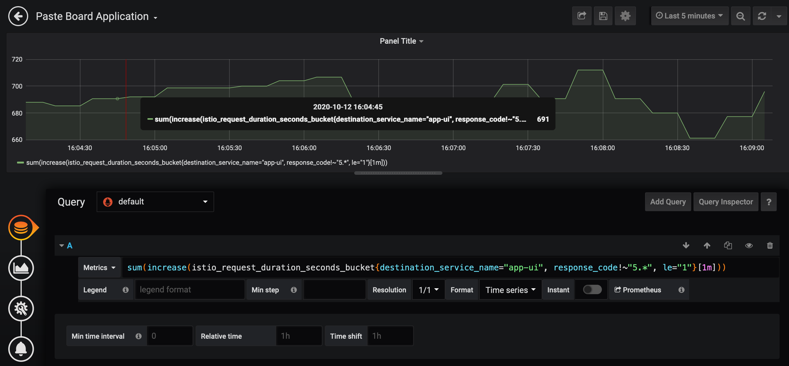<br/>

<br>

Perfect.  Now you just need to take this query and divide it by the total requests to get your SLO measurement.  Here is the final query.

```
sum(increase(istio_request_duration_seconds_bucket{destination_service_name="app-ui", response_code!~"5.*", le="1"}[1m])) / sum(increase(istio_requests_total{destination_service_name="app-ui"}[1m]))
```

Enter this query into Grafana, and you should see something like the following:

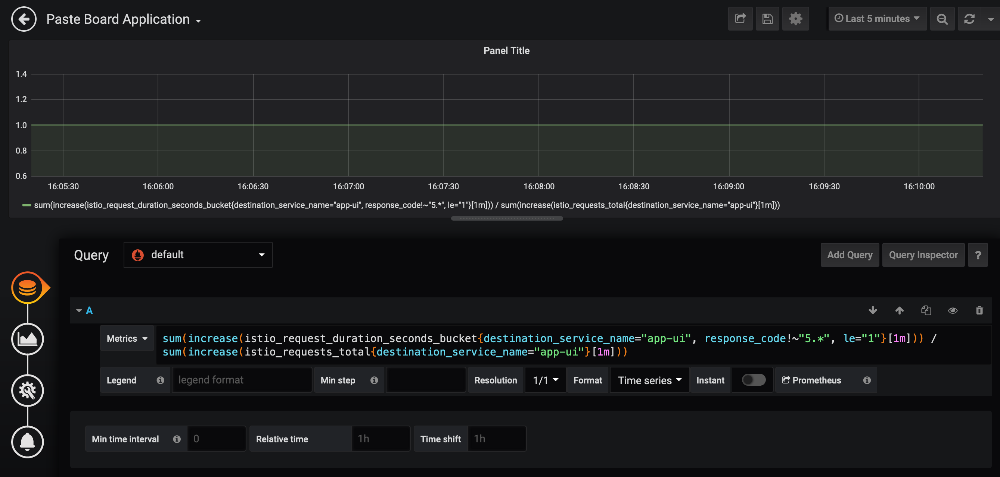<br/>

<br>

Let's pretty this up a bit:

* In 'Legend', put something more human readable.  For example, '% of successful requests to the UI that returned within 1 second (1 min interval)
* Under 'Visualization' Axes, change the unit to 'Misc - percent (0.0-1.0)'.  
* Under 'Visualization' Axes, change the Y-Min to '0' and Y-Max to '1.0'.
* Under 'Visualization' Thresholds & Time regions, add a threshold of less than ('lt') 0.95
* Under 'General' Title, change the title to 'SLO #1'
* Under 'General' Description, change the description to '95% of requests are successful and respond within 1 second (measured in 1 minute interval)'

Here are some images if you need help finding these settings:

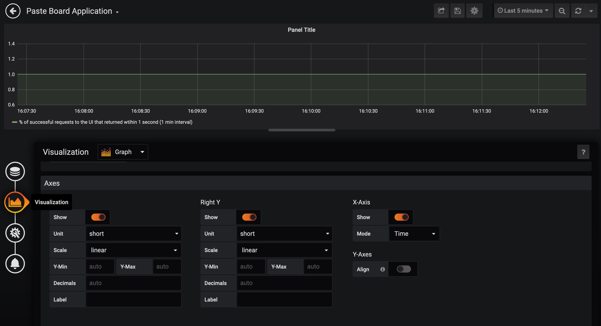<br/>
*Visualization*

<br>

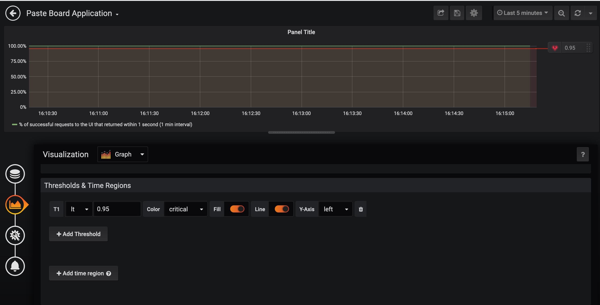<br/>
*Threshold*

<br>

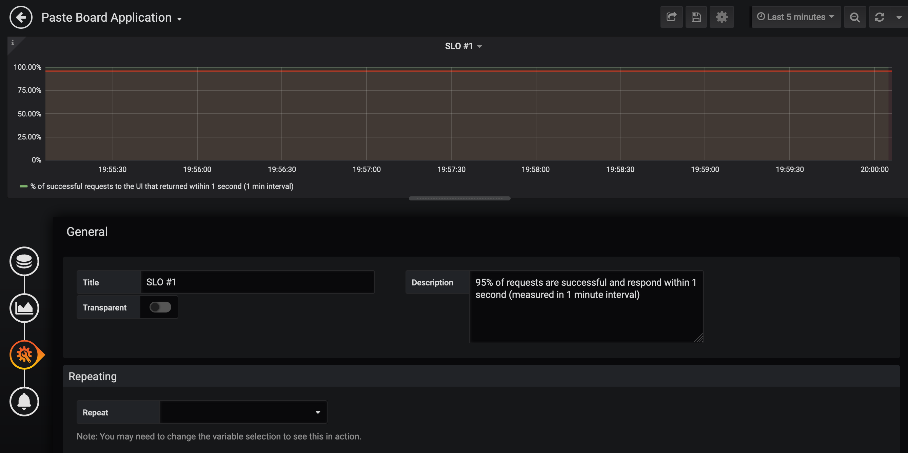<br/>
*General*

<br>

Your first SLO graph is ready to go!  The graph you created shows you the percentage of successful requests as measured by SLO #1.  The red line indicates the threshold in which the SLO is breached.  Everything should look healthy right now.

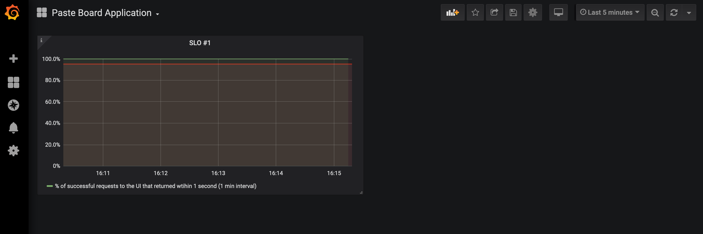<br/>

<br>

### Setup SLO #2

Now it's time to add a graph to monitor SLO #2.  Set this up on your own by applying what you learned in the previous task.  As a reminder, here is the second SLO:

* SLO #2: 90% of requests are successful and respond within 500 milliseconds (measured in 1 minute interval)

<details>
  <summary>Click here if you need help!</summary>

  There are two things different between the first and second SLOs: the availability and latency targets.

  The availability target is shown as a threshold in the previous graph.  Look at 'Visualization' Thresholds & Time Regions to adjust this value.

  The latency target is trickier.  Remember, we had to use a different metric called 'istio_request_duration_seconds_bucket' to include the latency target.  Here it is again for the first SLO:

  ```
  sum(increase(istio_request_duration_seconds_bucket{destination_service_name="app-ui", response_code!~"5.*", le="1"}[1m]))
  ```

  Inspect that query carefully.  Where did we specify the latency target?
</details>

After adding the second SLO graph, your dashboard should look like this:

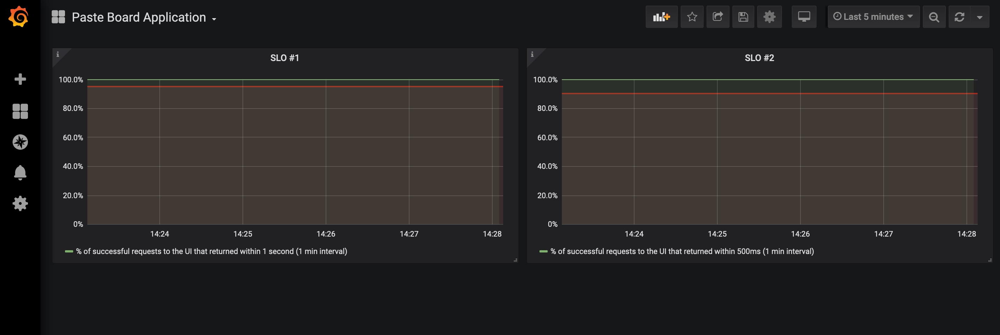<br/>

<br>

## Error Budgets

In the introduction labs, we discussed the concept of the error budget and why it matters.  As a reminder, you calculate an error budget as '100% - SLO', and this value indicates how much failure you can tolerate (i.e. the error budget).

Let's add error budget graphs to your dashboard.  Like before, we will do SLO #1 together, and you will complete SLO #2 on your own.

On the top, hover over the 'Add panel' icon as shown below.

<br/>

<br>

Select 'Add Query'.  You should see the panel view.

<br/>

<br>

You need to enter the query that calculates the error budget.  '100% - SLO' equals the following query:

```
1.0 - sum(increase(istio_request_duration_seconds_bucket{destination_service_name="app-ui", response_code!~"5.*", le="1"}[1m])) / sum(increase(istio_requests_total{destination_service_name="app-ui"}[1m]))
```

Enter this query into Grafana, and you should see something like the following:

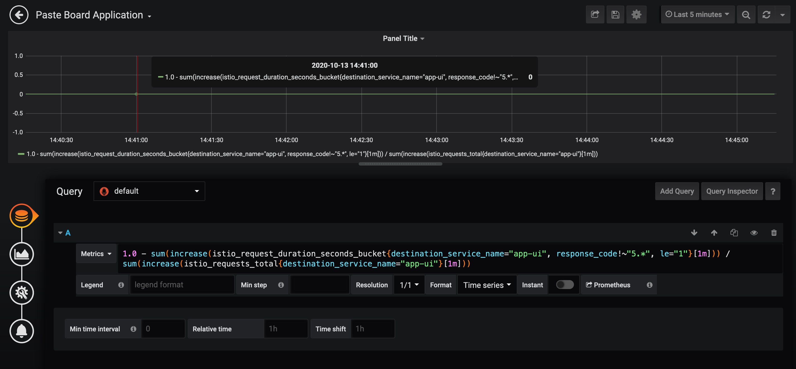<br/>

<br>

Let's pretty this up again:

* In 'Legend', put something more human readable.  For example, '% of requests that breached SLO #1 (1 min interval)'
* Under 'Visualization' Axes, change the unit to 'Misc - percent (0.0-1.0)'.  
* Under 'Visualization' Axes, change the Y-Min to '0' and Y-Max to '0.25'.
* Under 'Visualization' Thresholds & Time regions, add a threshold of greater than ('gt') 0.05
* Under 'General' Title, change the title to 'SLO #1 Error Budget'
* Under 'General' Description, change the description to 'SLO #1 has 5% failure threshold'

You can reorganize your graphs by highlighting the name of the graph and dragging it around the dashboard.  Feel free to reorganize.  (We like putting the error budget right below the SLO).  Your dashboard should look like this:

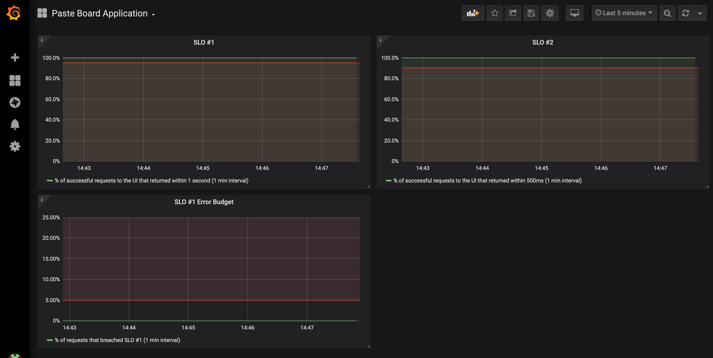<br/>

<br>

Let's take a step back and review what you just did.  You added a new graph to show the error budget of SLO #1.  Notice that the threshold is 'greater than 5%'.  This means - the error budget is exhausted when 5% or more of requests breach SLO #1.  Why is the threshold 5%?  Because the availability target for the first SLO is 95%.  Right now, there are no failures so the percentage of requests that breach SLO #1 is 0%.

Awesome!  Let's add the error budget graph for the second SLO.  Set this up on your own by applying what you just learned.  As a reminder, here is the second SLO:

* SLO #2: 90% of requests are successful and respond within 500 milliseconds (measured in 1 minute interval)

Note: Remember to change the latency!  Don't just copy and paste the same query for the second SLO.

<details>
  <summary>Click here if you need help!</summary>

  The query to calculate the error budget for the first SLO is:

  ```
  1.0 - sum(increase(istio_request_duration_seconds_bucket{destination_service_name="app-ui", response_code!~"5.*", le="1"}[1m])) / sum(increase(istio_requests_total{destination_service_name="app-ui"}[1m]))
  ```

  You need to change that query to measure the second SLO.

  Don't forget the threshold!  The availability target for the second SLO is 90% (not 95%), so the threshold is 10%.  Make sure to put that value as the threshold in your graph.

</details>

After adding the second SLO error budget graph, your dashboard should look like this:

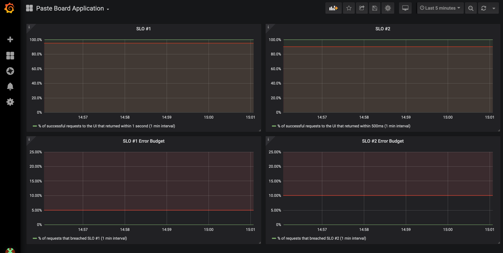<br/>

<br>

## Summary

Note: If you would like to check your work, you can import the pre-existing dashboard in Grafana using the workshop repo [here][9].

This lab showed critical tasks for a SRE: creating SLOs and building graphs to monitor SLOs and error budgets.  Both are crucial.  You need to build consensus with different stakeholders to create SLOs, and you need to have good tools in place to monitor and act on SLOs if and when they are breached.

Another point to emphasize: SLOs do not have to be perfect!  Perfection is not the goal.  You should be iterating on SLOs and their targets over time as you observe the behavior of your application.

Check out these really great Red Hat blog posts [part 1][7] and [part 2][8] to learn more about monitoring like a SRE in OpenShift.  The tasks in this lab were inspired by these articles.

[1]: https://grafana.com/
[2]: https://grafana.com/docs/grafana/latest/panels/panels-overview/
[3]: https://landing.google.com/sre/workbook/chapters/implementing-slos/#choosing-an-appropriate-time-window
[4]: https://grafana.com/blog/2020/02/04/introduction-to-promql-the-prometheus-query-language/
[5]: https://prometheus.io/docs/prometheus/latest/querying/basics/
[6]: https://prometheus.io/docs/prometheus/latest/querying/functions/#increase
[7]: https://www.openshift.com/blog/monitoring-services-like-an-sre-in-openshift-servicemesh
[8]: https://www.openshift.com/blog/monitoring-services-like-an-sre-in-openshift-servicemesh-part-2-collecting-standard-metrics-3
[9]: https://github.com/RedHatGov/sre-workshop-code/blob/main/dashboard/sample.json