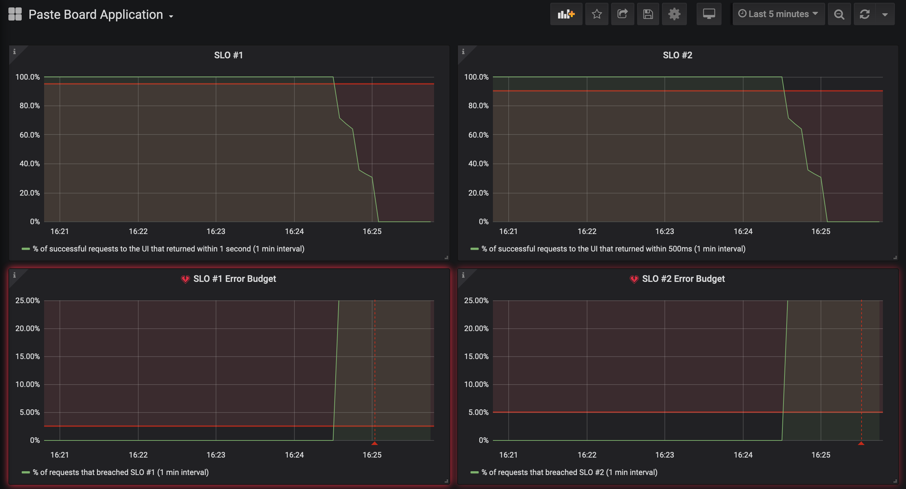

# Autoscaling

## Background

At this point in the workshop, we present to you a number of scenarios to enact with your microservices application.  Each scenario causes some type of change that impacts your SLO.  As the SRE, it is your mission to ensure the uptime of the application as you enact these scenarios.

In this scenario, the product manager has informed you that they expect an increase in the number of users as the marketing campaign for the application kicks off.  Exciting!  However, you don't want to manually adjust the number of application pods in OpenShift.  In anticipation of this growth, you decide to add [autoscaling][1] to the application using the Horizontal Pod Autoscaler.  This is a fundamental capability in OpenShift that allows your application to dynamically scale.  By default, the Horizontal Pod Autoscaler will scale your application based on CPU metrics.  Everything looks healthy right now, so let's go ahead and make this change.

## Run

Make sure you are sending traffic to the app if you aren't already:

```execute
while true; do curl -s -o /dev/null $GATEWAY_URL; done
```

Add autoscaling:

```execute
oc apply -f scenarios/autoscaling/app-ui-autoscale.yaml
```

Open your dashboard.  Wait a minute and hit the refresh icon in the top right:

<br/>

<br>

Your SLOs are breached, and the error budgets are depleted:

<br/>

<br>

Open the application in the browser:

```execute
echo $GATEWAY_URL
```

It returns `no healthy upstream`.  Not good.  Your application is inaccessible, and your users are very unhappy.

## Triage

Note: None of these scenarios require you to make changes to the application code!

What went wrong?  This is an exercise for you to find out as the SRE!

Identify:
* How to roll back this change to a previous healthy state
* What factors contributed to the failure?
* How to fix the issue and add autoscaling successfully

Bonus:
* Would this behavior change with a `Deployment` instead of `DeploymentConfig`?  How?

<details>
  <summary>Click here if you need help!</summary>

  Look at the horizontal pod autoscaler:

  ```execute
  oc describe hpa app-ui
  ```

  There are 0 application pods requested.

  Let's double check:

  ```execute
  oc get pods -l app=app-ui
  ```  

  Nothing is returned.  There was clearly an application pod running before.  How could this have happened?  

  Look at the autoscaling spec:

  ```execute
  cat sre-workshop-code/scenarios/autoscaling/app-ui-autoscale.yaml
  ```

  What might we have done wrong here?

</details>

## End

Leave autoscaling on once you complete this scenario.

**DO NOT PROCEED** to the next lab until you are ready to view the solution!

[1]: https://docs.openshift.com/container-platform/4.5/nodes/pods/nodes-pods-autoscaling.html