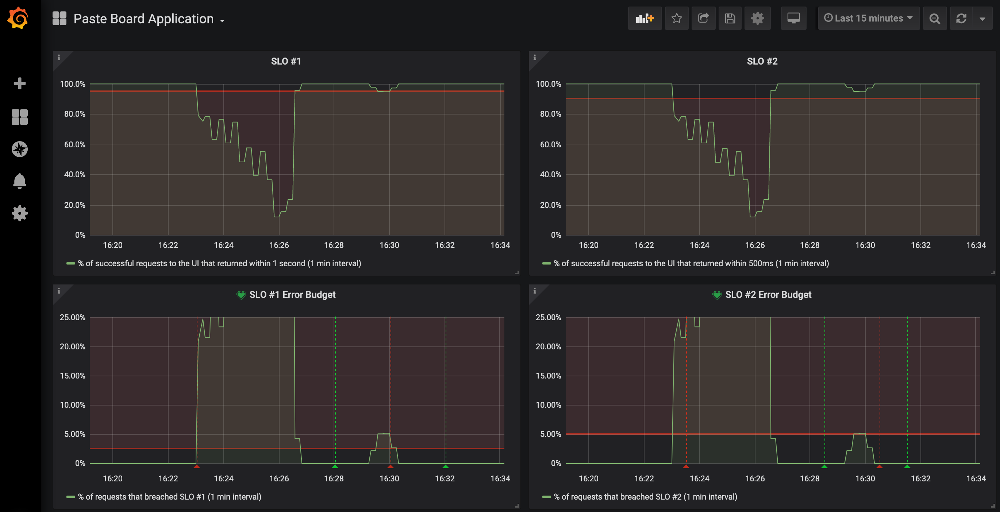

# Health Checks

## Background

In this scenario, your team lead has asked you add to [health checks][1] to the application.  They say that without health checks the application can serve user requests even if it is in an unhealthy state.  Not good!  Fortunately, OpenShift provides health check probes.  The `ReadinessProbe` will ensure the application is ready before it receives traffic, and the `LivenessProbe` will restart the application pod if it determines the application is unhealthy.  Everything should be healthy right now, so let's go ahead and make this change.

## Run

Make sure you are sending traffic to the app if you aren't already:

```execute
while true; do curl -s -o /dev/null $GATEWAY_URL; done
```

Add health checks to the application:

```execute
oc apply -f scenarios/healthchecks/probes.yaml
```

Open your dashboard.  Wait a minute and hit the refresh icon in the top right:

<br/>

<br>

Your SLOs are in good standing:

<br/>

<br>

But what happens if your application needs to scale?  Stress the application:

```execute
siege -c 100 $GATEWAY_URL/stress
```

Wait 5 minutes.  Your SLOs are breached, and the error budgets are depleted:

<br/>

<br>

Note: If you wait long enough (~10m), the application SLO will recover but the root cause will not be fixed!  It might look like this:

<br/>

<br>

## Triage

Reminder: None of these scenarios require you to make changes to the application code!

What went wrong?  This is an exercise for you to find out as the SRE!

Identify:
* How to roll back this change to a previous healthy state
* What factors contributed to the failure?
* How to fix the issue and add health checks successfully

<details>
  <summary>Click here if you need help!</summary>

  Look at the horizontal pod autoscaler:

  ```execute
  oc describe hpa app-ui

  The HPA is working and requested additional pods.

  But look at your application pods:

  ```execute
  oc get pods -l app=app-ui
  ```
  
  The newest version of the application fails to deploy.

  What's the difference between the old and new versions?  Look at the probes you added:

  ```execute
  cat sre-workshop-code/scenarios/healthchecks/probes.yaml
  ```

  Look at the [documentation][1] for Readiness and Liveness Probes.  What might be missing in the probe configuration?

</details>

## End

**DO NOT PROCEED** to the next lab until you are ready to view the solution!

[1]: https://docs.openshift.com/container-platform/4.5/applications/application-health.html