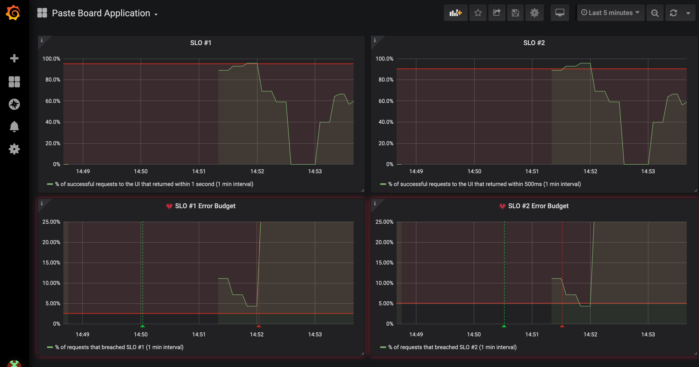

# Cron Job

## Background

In this scenario, a software engineer on your team plans to run an analytical workload to calculate the most active users on the paste board application.  This calculation changes over time, so the engineer plans to run a recurring [Cron Job][1].  The engineer informs you this analytical workload is CPU intensive, but the cluster has enough resources to run this job alongside the core application.  

For the purposes of this workshop, the cron job should:

* Request 2 vCPU and consume up to 4 vCPU
* Run every minute 
* Only run 1 job at a time

Everything should be healthy right now, so let's go ahead and make this change.

## Run

Make sure you are sending traffic to the app if you aren't already:

```execute
while true; do curl -s -o /dev/null $GATEWAY_URL; done
```

Check resource quotas:

```execute
oc get quota
```

The core application should only be consuming `500m` at this time.

Run the cron job:

```execute
oc create -f sre-workshop-code/scenarios/cronjob/cronjob.yaml
```

Open your dashboard.  Wait 5 minutes and hit the refresh icon in the top right:

<br/>

<br>

Your SLOs are in good standing:

<br/>

<br>

But what happens if your application needs to scale?  Stress the application:

```execute
siege -t 1H -c 6 "$GATEWAY_URL/stress"
```

Your SLOs are breached, and the error budgets are depleted:

<br/>

<br>

## Triage

Reminder: None of these scenarios require you to make changes to the application code!

What went wrong?  This is an exercise for you to find out as the SRE!

Identify:
* How to roll back this change to a previous healthy state
* What factors contributed to the failure?
* How to fix the issue and add health checks successfully

<details>
  <summary>Click here if you need help!</summary>

  Look at the quota consumption:

  ```execute
  oc get quota
  ```

  You should see your quota maxed out.

  Now look at the pods:

  ```execute
  oc get pods
  ```

  You should see multiple copies of the cron job running.

  How could this be?  The cron job specification should only run 1 job at a time.

  Look at the cron job you added:

  ```execute
  oc describe cronjob high-cpu-workload
  ```

  What might we have misconfigured?  Look at the [documentation][1] for more details.

</details>

## End

**DO NOT PROCEED** to the next lab until you are ready to view the solution!

[1]: https://docs.openshift.com/container-platform/4.6/nodes/jobs/nodes-nodes-jobs.html